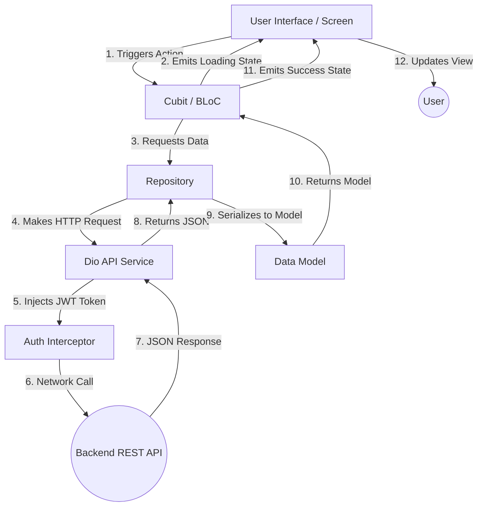

# Application Architecture

## 1. Architectural Pattern

The application follows a highly structured, scalable **Clean Architecture** variant customized for Flutter, specifically combining the **BLoC (Business Logic Component)** pattern for State Management with the **Repository Pattern** for Data abstraction.

This architecture divides the application into three main layers:

### A. Presentation Layer (`lib/screens`, `lib/widgets`)
- **Purpose:** Handles the UI representation and user interactions.
- **Responsibility:** Subscribes to state changes from BLoCs/Cubits and rebuilds the UI accordingly. Dispatches events to Cubits based on user actions.
- **Rules:** Must not contain any business logic or direct API calls. All data must be fetched through state emission from Cubits.

### B. Business Logic Layer (`lib/blocs`)
- **Purpose:** Acts as the intermediary between the UI and the Data layer.
- **Responsibility:** Contains all `Cubit` classes. It calls functions from the Repositories, catches exceptions, and emits the respective states (e.g., `Loading`, `Loaded`, `Error`) to the Presentation Layer.
- **Framework:** `flutter_bloc` using `Cubit`. Cubit is a lightweight version of BLoC that manages state via functions instead of streams of events.

### C. Data Access Layer (`lib/repositories`, `lib/core/network`)
- **Purpose:** Abstracts the data sources from the Business Logic Layer.
- **Responsibility:** Repositories call the `ApiService` to fetch data, serialize JSON responses into Dart Models (`lib/data/models`), and handle specific HTTP Exceptions.
- **Network Implementation:** The `DioClient` (`lib/core/network/dio_client.dart`) is configured with a base URL, timeouts, logging interceptors, and an `AuthInterceptor` which automatically injects the JWT token into request headers.

---

## 2. Complete Application Flow

The data flows in a unidirectional manner.

1. **User Interaction:** The user taps a button on the UI (e.g., "Sign In" in `LoginScreen`).
2. **Action Dispatch:** The UI calls a function on the injected Cubit (`context.read<AuthCubit>().login(userId, password)`).
3. **State Change (Loading):** The Cubit immediately emits an `AuthLoading` state. The UI responds by showing a `CircularProgressIndicator`.
4. **Repository Call:** The Cubit awaits the result from the `AuthRepository`.
5. **API Request:** The `AuthRepository` makes a POST request to the server using the `ApiService` (Dio). The request passes through the `AuthInterceptor`.
6. **Backend Processing:** The Node.js server processes the request, interacts with MongoDB, and sends a JSON response.
7. **Model Serialization:** The `AuthRepository` receives the JSON response, validates it, and converts it into a `UserModel`. If the token is returned, it securely stores it in `flutter_secure_storage`.
8. **State Emission (Success/Error):** The `AuthRepository` returns the `UserModel` back to the Cubit. The Cubit emits the `AuthAuthenticated` state. If an error occurred, an `AuthError` state is emitted.
9. **UI Update:** The `BlocConsumer` listening to `AuthCubit` detects the `AuthAuthenticated` state and navigates the user to the `HomeScreen`.

### Flow Diagram

---

## 3. Dependency Injection

The application uses a mix of `get_it` (implied by pubspec, though largely managed via BLoC Providers) and `flutter_bloc`'s Provider ecosystem for Dependency Injection.

In `main.dart`:
1. The global `ApiService` is instantiated.
2. `MultiRepositoryProvider` is used to inject all Repositories (`AuthRepository`, `CustomerRepository`, etc.) down the widget tree.
3. `MultiBlocProvider` is used to inject all Cubits (`AuthCubit`, `CustomerCubit`, etc.). The Cubits are created by reading their respective Repositories from the context (`context.read<Repository>()`).

This ensures that only a single instance of each Repository and Cubit exists globally, saving memory and ensuring synchronized data states across different screens.
